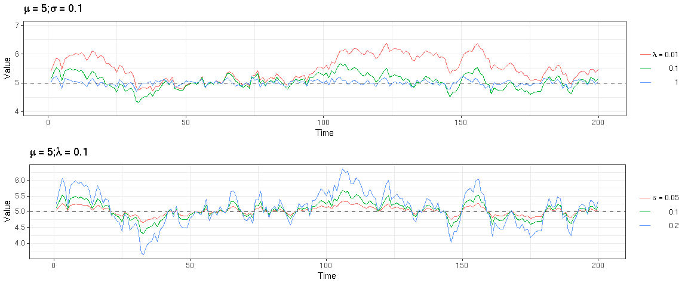
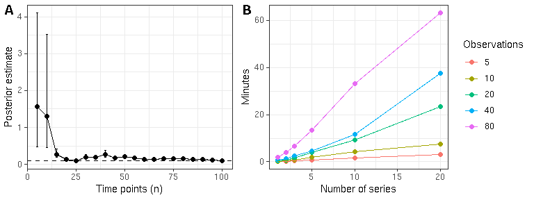
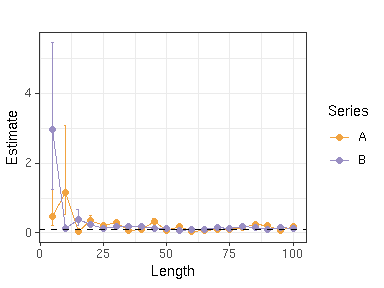
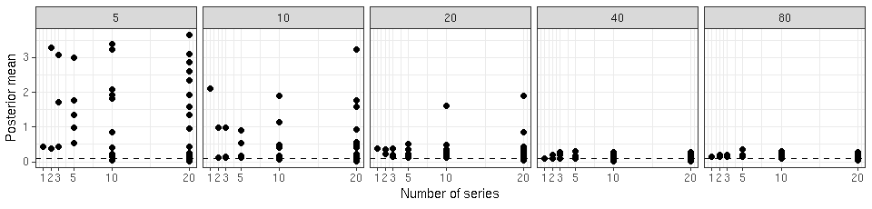

Introduction
------------

This work investigates probabilistic time series models that are
motivated by applications in statistical ecology. In particular, we
investigate variants of the mean-reverting and stochastic
Ornstein-Uhlenbeck (OU) process. We provide a hierarchical extension for
joint analysis of multiple (short) time series, validate the model, and
analyze its performance with simulations. The work extends the recent
Stan implementation of the OU process (Goodman 2018), where parameter
estimates of a Student-t type OU process are obtained based on a single
(long) time series. We have added a level of hierarchy, which allows
joint inference of the model parameters across multiple time series.

Motivation for this work comes from the analysis of human gut microbiome
dynamics. It has been reported that on average the abundance of many gut
bacteria remains relatively stable over long time periods (David et al.
2014). However, on a shorter (daily) time scale these abundances can
exhibit considerable fluctuations. A number of cross-sectional studies
of the human microbiome have characterized the diversity and variation
of the gut microbiome between individuals (e.g. Huttenhower et al. 2012;
Qin et al. 2009). The temporal dynamics of microbial organisms within
individuals is, however, less well understood (Faust et al. 2015). Given
the complex and highly individual nature of the gut ecosystem, exact
dynamical models fail to capture the rich stochastic dynamics that these
systems have been reported to exhibit.

The OU-type processes provide non-parametric means to characterize key
properties of system dynamics, such as the location and resilience of
the potential wells, when the data-generating mechanisms are unknown.
Variants of the OU process provide rigorous and justified methods for
modeling stochastic dynamics in mean-reverting time series. The
methodology itself is very generic, and its potential applications
naturally reach beyond population dynamics. Apart from (Goodman 2018) we
are not aware of applications of these models in the context of human
microbiome studies. One of the contemporary challenges in this field is
that the currently available time series are often short, sparse and
noisy, limiting robust inference of dynamical models. When data for
individual time series is limited, aggregating information across
multiple time series can potentially help to obtain more robust
estimates of the model parameters and to analyze individual variation in
the overall population context. Hierarchical modes provide a natural
framework for such analysis. In the following, we describe the OU
process and the hierarchical extension, validate the implementation,
analyze model performance, and conclude with discussion on the
encountered challenges and further work.

Fig. 1: Effects of the mean-reversion rate *λ* and stochasticity
parameter *σ* on time series shape. Simulated data generated with the
function `generate_n_series`.

Ornstein-Uhlenbeck process
--------------------------

The Ornstein-Uhlenbeck process, also known as the Langevin equation in
physics and Vasicek model in finance, is a stochastic process with a
wide range of applications (Iacus 2008). It has been used to model
systems with a steady state that recover from perturbations by returning
to the long term mean (Fig. 1).

The OU process is defined by the stochastic differential equation
*d**X**t* = *λ*(*μ* − *X**t*)*d**t* + *σ**d**Z**t*,
 where *X**t* is the state of the system at time t and *Z* a
stochastic process. Unlike with an ordinary differential equation, the
solutions of the stochastic counterpart are nowhere differentiable and
non-unique as they are different for different realizations of the noise
term. Averaging over these solutions recovers the deterministic
solution.

The first term on the right hand side ("drift") describes the
deterministic behavior and the second term ("dispersion") characterises
the stochasticity of the system. The parameters have natural
interpretations as long-term mean (*μ*), mean-reversion rate (*λ*), and
scale of stochastic fluctuations (*σ*). The expected half life of a
perturbation is given by $T\_{1/2} = \\frac{\\log2}{\\lambda}$.

The standard OU process uses (Gaussian) white noise to characterize the
stochastic variation. In practice, however, requiring *Z**t*
to be Brownian motion with Gaussian transition density is often too a
limiting assumption as this does not allow large enough fluctuations and
thus is less robust against outliers than more heavy-tailed models
(Solin and Särkkä 2015). A more general choice is to use the Student-*t*
process. This allows a greater stochastic variation between consecutive
points. The process *f* is a Student-t process, *f* ∼ 𝒮𝒯(*ν*, *μ*, *K*),
with *ν* degrees of freedom, mean parameter *μ* and covariance kernel
*K*, if any finite set of values is multivariate Student-*t*
distributed. A vector *ȳ* ∈ ℝ*n* is multivariate Student-t
distributed, *ȳ* ∼ 𝒮𝒯*n*(*ν*, *μ*, *K*) if it has density

$$p(\\bar{y}) = \\frac{\\Gamma(\\frac{\\nu + n}{2})}{((\\nu-2)\\pi)^{\\frac{n}{2}}\\Gamma(\\frac{\\nu}{2})}|K|^{-\\frac{1}{2}}\\times\\Big(1 + \\frac{(\\bar{y}-\\bar{\\mu})^T K^{-1}(\\bar{y}-\\bar{\\mu})}{\\nu - 2}\\Big)^{- \\frac{\\nu+n}{2}}$$
.

In general, this model assumes that the process density is unimodal and
likelihood of a point decreases as the distance to the mode increases.
This assumption ensures that the model satisfies the relatively simple
dynamical nature of a single potential well. Elliptically symmetric
processes have such properties and the Student-t processes are the
largest subset of elliptically symmetric process that have an analytical
solution (Shah, Wilson, and Ghahramani 2014); this is a convenient
choice also in the sense that the Gaussian process can be obtained as a
special case (Solin and Särkkä 2015).

Transition density *X**t*|*X*0 of a Gaussian OU
process is normally distributed with mean
*μ* − (*μ* − *X*0)*e*−*λ**t* and variance
*κ*(1 − *e*−2*λ**t*). From these expressions we can obtain
the long term mean, *μ*, and variance, *σ*, as *t* → ∞. Covariance
between two time points is given by

$$\\textrm{Cov}\[X\_t, X\_{t+\\Delta t}\]= \\frac{\\sigma^2}{\\lambda} e^{-\\lambda\\Delta t}.$$

Now let us recall that if *X* ∼ 𝒩(*μ*, *σ*2), then the random
variable *X* + *ϵ**σ*, where *ϵ* ∼ 𝒩(0, 1) is Student-t distributed with
*ν* = 1 degrees of freedom. Thus we get an expression relating the error
terms *ϵ**i* and process values *X**i* at times
*t**i* and *t**i* − 1,
*Δ**t* = *t**i* − *t**i* − 1:
$$X\_1 = \\mu + \\epsilon\_1 \\frac{\\sigma}{\\sqrt{\\lambda}}$$
 and
$$X\_i = \\mu - (\\mu-X\_{i-1})e^{-\\lambda \\Delta  t} + \\epsilon\_i \\sigma \\sqrt{\\frac{1-e^{-2\\lambda \\Delta t}}{\\lambda}},$$
 for *i* = 2, …, *n*.

Conditional expression for the density of error terms can be derived
from Lemma 3 in (Shah, Wilson, and Ghahramani 2014)
$$\\epsilon\_i | \\epsilon\_{1},\\ldots, \\epsilon\_{i-1} \\sim \\textrm{MVT}\_1 \\Big(\\nu+i-1, 0, \\frac{\\nu -2 + \\sum\_{k=1}^{i-1}\\epsilon\_k^2}{\\nu -3 + i} \\Big), $$
 which reduces to

$$p(\\epsilon\_i| \\epsilon\_{1},\\ldots, \\epsilon\_{i-1}) \\propto \\Gamma(\\tfrac{\\nu+i}{2})\\Gamma(\\tfrac{\\nu+i-1}{2})^{-1}\\big(\\nu -2 + \\sum\_{k=1}^{i-1}\\epsilon\_{k}^{2}\\big)^{-\\frac{1}{2}} \\Big(1+ \\frac{\\epsilon\_i^2}{\\nu -2+\\sum\_{k=1}^{i-1}\\epsilon\_k^2} \\Big)^{-\\frac{\\nu + i}{2}}.$$

We use this expression in the Stan code model block to increment the log
density. For implementation details, see the Rmarkdown source file in
the [project repository](https://github.com/velait/OU).

Hierarchical extension
----------------------

The model outlined above describes the Ornstein-Uhlenbeck driven
t-process as implemented in (Goodman 2018). Our novel contribution that
we present now is to equip the model with hierarchical structure and
testing the robustness of the extended implementation. Let
$\\mathcal{X} = \\{\\bar{X\_i}, i \\in \\{1, \\ldots, N\\}\\}$ be a set
of OU process values, with *n**i* observations in each, each
*i* representing e.g. a different measurement site. We assume a
hierarchical structure for the parameters *λ*, *μ* and *σ*,

*d**X**j*, *t* = *λ**j*(*μ**j* − *X**j*, *t*)*d**t* + *σ**j**d**Z**t*,

for all *j* ∈ {1, …, *n**i*}.

For a general and simplified treatment of the OU process we assume our
observations to be directly generated from the OU process and use
uniform time intervals. In would be relatively straightforward to modify
the existing implementation to incorporate unequal time intervals.
Additional models for observation noise provide interesting
opportunities for further extensions. In ecological studies, that
motivate our work, the observation noise is often modeled with a
Gaussian or Poisson distribution, where the rate parameter is obtained
from the OU process which is transformed into via exponentiation. This
so called stochastic Gompertz model is frequently used in ecological
time-series analysis (Dennis and Ponciano 2014). For OU process
implementation of the Gompertz model in the context of a single time
series, see (Goodman 2018).

We have implemented the [hierarchical extension with
RStan](https://github.com/velait/OU/blob/master/fixed_parameter_hierarchical_noncentered.stan).
In summary, the idea of the Stan code is as follows. After declaring the
data and model parameters, error terms *ϵ**i* and latent
values *X**i* are related in the transformed data block. In
the model block parameters and conditional densities for the error terms
are incremented to the log density and the observations
*Y**j**i* are sampled from a normal distribution with
*X**i* as the mean and small variance. Adding a level of
hierarchy to the existing implementation can be obtained by modifying
the model likelihood in the extended version so that it equals the
product of transition densities of individual series:

$$\\prod\_{i=1}^N\\prod\_{j=1}^{n\_i} p(\\epsilon\_{i,j}| \\epsilon\_{i,1},\\ldots, \\epsilon\_{i,j-1})$$

We have used a non-centered parameterization with error terms
*ϵ**i*. In our initial experiments the centered
parameterization resulted in less accurate results and more divergent
transitions. This is in agreement with (Team 2017, 145) where it is
mentioned that hierarchical models tend to perform better with
non-centered parameterizations, especially when the sample size is
limited.

Model validation
----------------

A full OU process model would allow the inference of all three model
parameters *μ*, *λ*, and *σ*. In our experiments, we achieved successful
inference for *μ* and *λ* but the *σ* parameter has persisting
convergence problems that currently forms a bottleneck for inferring all
model parameters simultaneously. In this work, we focus on the analysis
of the *λ* parameter, as empirical estimates for mean reversion (*λ*)
are often more difficult to obtain than for the mean parameter (*μ*).
Moreover, the mean reversion parameter is often specifically interesting
in ecological applications as it quantifies the resilience of a
dynamical system. Assuming that the system is in a stationary state and
the time series is sufficiently long, the mean of the data provides an
empirical approximation for the mean parameter *μ*. The stochastic *σ*
parameter behaves symmetrically, and the analysis may be robust to
variations in the scale of this parameter, although this is to be tested
systematically. In the present analysis, we assume that *μ* and *σ* are
fixed to known values. We are continuing the work towards joint
inference of all model parameters in the hierarchical setting and these
will be posted in the [model repository](https://github.com/velait/OU/)
as they become available.

Hence, we investigate the robustness of the mean reversion parameter *λ*
to variations in sample size and time series lengths based on simulated
data. In particular, we test the model on simulated data generated by
the sampling scheme in Lemma 2.2 (Solin and Särkkä 2015): if
*ȳ*|*γ* ∼ 𝒩(**μ**, *γ**K*), where *γ* is inverse gamma distributed
*γ* ∼ IG(*ν*/2, (*ν* − 2)/2), then marginally
*ȳ* ∼ MTV*n*(*μ*, *K*, *ν*). The function `generate_n_series`
returns a list of n series with the given parameter values. We have
fixed the parameters to the following values, unless otherwise noted.
Mean reversion rate *λ* = 0.1 corresponds to a half-life of about seven
units of time so it is reasonable in terms of time resolution. The
selected demonstration values allow the occurrence of both the
deterministic and stochastic effects, and generate time series whose
characteristics resemble those of real microbial time series. We have
used 4000 iterations in sampling and two chains per stan call in order
to keep the sampling times practically limited.

### Standard model with a single time series

In order to assess how many samples are needed for a reliable inference
of a single series we test the model with simulated data with different
sample sizes. In Fig. 2A, the posterior means and 50% interquartile
ranges are plotted against time series length. As expected, the
estimates converge to the simulation value as sample size increases and
with very few observation the estimates are inaccurate. Based on this
test around 20 samples are needed for a reliable inference with the
given parameter values. Running times grow linearly with sample size
(Fig. 2B).

Fig. 2: **A** Means and 50% interquartile ranges of the posteriors for
lambda against length of the series. Dashed line marks the simulation
value 0.1. More systematic analysis with multiple seires can be found in
the next chapter. **B** Sampling times in minutes for the simulation
data sets on a basic laptop (1,3GHz, 4 cores).

### Hierarchical extension with multiple time series

As the first validation of the hierarchical implementation, we
demonstrate that a model with two simulated time series converges to
their known long-term mean values (Fig. 3). This indicates that the
hierarchical model works as expected regarding the inference of the mean
reversion parameter *λ*. We also performed initial experiments in order
to compare convergence rates between the individual versus joint
(hierarchical) modeling of the time series but observed no significant
differences in the convergence rate and accuracy of *λ* with the current
parameter ranges (data not shown).

Fig. 4: The simulated time series converge to their (known) long-term
mean values in the hierarchical model as expected.

As a second test, we increased the number of time series and varied the
amount of observations to assess how the number of time series affects
the inference in the hierarchical model. As expected and evident in the
previous sections there is improvement in accuracy as series length is
increased. However, our current results indicate that additional series
seem to make only minor improvements in the model performance (Fig. 5).
This is unexpected since, theoretically, both time series length and
numbers should provide equally valuable extra information for the joint
modeling, and hence result in improved posterior inference. This hints
at shortcomings in the hierarchical implementation.

Fig. 5: Number of time series (x-axis) versus the posterior mean of the
*λ* parameter. The title in each panel denotes the number of
observations per time series. The dashed line represents the known
simulation value of lambda. The observations suggest that the posterior
inference improves with increasing time series length but not with
increasing number of time series.

Discussion
----------

The main objective of this work has been to provide a hierarchical
version of the Ornstein-Uhlenbeck driven Student-t process in Stan,
motivated by contemporary applications in statistical ecology. For
instance, a recently published HITChip Atlas data set (Lahti et al.
2014), consists of microbiome profiling from stool samples with 2-5 time
points per subject. Joint analysis of the multiple time series is
expected to provide information on the typical, universal abundance
ranges and resilience of the different microbial organisms in the human
gut ecosystem that are shared across the population. Moreover,
hierarchical models could be used to systematically compare the effects
of different phenotypic changes on microbial dynamics. Although a more
comprehensive analysis of the possible parameter ranges will be
valuable, our results indicate that 20 time points or more may be needed
for reliable inference with the current implementation. Aggregating
information across multiple time series did not improve posterior
inference as expected but solving this issue might allow reliable
inference also based on shorter time series.

Our current implementation operates on a fixed prior distribution, and
allows partial pooling of multiple time series. Partial pooling can
provide regularization for parameter inference, which can be
particularly valuable when the sample sizes and time series lengths are
limited, as in human microbiome studies. In that context partial pooling
model is suited for instance to simultaneously analyse the dynamics of
multiple microbial species. In the human gut, hundreds of distinct
bacterial species are frequently encountered, and many of them exhibit
mean-reversing variation that can be modeled with the OU process. In
this context, each microbial species is assumed to have its own
dynamical parameters, and comparing the mean (*μ*), mean reversion rate
(*λ*), and stochastic fluctuations (*σ*) between species can provide
useful information on the overall microbial ecosystem dynamics. Relaxing
the assumption of fixed priors by hyperparameter inference would be a
relevant further extension. At the same time, our implementation is a
step towards a model where the hierarchy concerns sets of time series
where the model parameters are shared within each set. This could be
used to assess differences between relevant phenotype groups such as
healthy and compromised study subjects; there all model parameters are
potential interest, and can be interpreted as the mean microbial
abundance (*μ*), resilience of a species (*λ*), and volatility of a
species abundance (*σ*). Changes in these parameters under varying
conditions are of regular interest in microbial ecology. In the present
work, we have been working with the first type of model, where each set
includes only a single time series. Our initial experiments with the
model with multiple time series per set will provide a useful extension
but have currently unresolved convergence issues.

Alternatives for the OU process model, and its Student t variant would
include for instance hidden mixture models, which could characterize
wider variation in the data than is allowed by the standard Gaussian
models. The specific advantage of the OU process is the focus on the
mean reversion, which is frequently observed in ecological applications,
for instance. Whereas we have in this work focused on the inference of
the mean reversion parameter *λ*, the expected benefits of a
hierarchical model will become more clearly visible with the full and
more complex model where all parameters are inferred simultaneously. One
of the potential advantages of the hierarchical model is that joint
analysis of multiple time series can allow more rapid convergence of the
parameter estimates with low sample sizes when the parameters follow the
same prior distribution. We did not, however, observe significant
differences in the convergence rates of *λ*, compared to separate
modeling of each individual time series. Moreover, future work will
benefit from more thorough analysis of modeling details such as the
choices for priors and code optimization.

In summary, we have implemented a hierarchical extension of the OU
process model and demonstrated that it can successfully infer known mean
reversion parameters in simulated data sets. However, the hierarchical
implementation still suffers from convergence problems with the
stochastic *σ* parameter, which forms currently a severe limitation for
practical application. The tests executed here provide a preliminary
results of the model capabilities. For a complete picture an extensive
probing of different parameter ranges and (hyper)priors should be
undertaken. Alternative parameterizations should be tested to see if
some perform better with different sample sizes. This would allow the
analysis of time series with missing values and eliminate the need for
interpolation and forcing even observation times, techniques that have
traditionally been used in these situations.

Supplementary material
----------------------

The full reproducible source material of this report is available via
[Github](http://github.com/velait/OU). The following minimal example
demonstrates how to simulate two OU process time series and sample form
the posterior of the hierarchical model based on the functions available
via the Github repository.

    # Load libraries
    require(rstan)
    require(shinystan)

    # Simulate two time series and combine to make a set suitable for the stan model
    example_data <- generate_n_series(n=2, sigma=0.1, lambda=0.1, mu=5,
                                      intervals = 1:50, t.df = Inf,
                      fix_mu = 5,
                      fix_kappa_log = log(0.1),
                      seed = 1) %>%
             concatenate_series()

    # Stan model
    # fixed_par_model <- stan_model("fixed_parameter_hierarchical_noncentered.stan")

    # Draw samples
    example_samples <- sampling(fixed_par_model, example_data, chains=2)

    # Launch shiny stan to view results
    # launch_shinystan(example_samples)

Licencing and Acknowledgements
------------------------------

Code and text © 2018, Ville Laitinen & Leo Lahti, licensed under CC BY
4.0. This work has been supported by Academy of Finland (grants 295741
and 307127).

Bibliography
------------

David, A, A Materna, J Friedman, and others. 2014. “Host Lifestyle
Affects Human Microbiota on Daily Timescales” 15. Genome Biology: R89.

Dennis, B, and JM Ponciano. 2014. “Density Denpendent State Space Model
for Population Abundance Data with Unequal Time Intervals” 95. Ecology:
2069–75.

Faust, K, L Lahti, D Gonze, WM de Vos, and J Raes. 2015. “Metagenomics
Meets Time Series Analysis: Unraveling Microbial Community Dynamics.”
Current Opinion in Microbiology.

Goodman, A. 2018. “Fitting Ornstein-Uhlenbeck-Type Student’s T-Processes
in Stan.”
<https://github.com/stan-dev/stancon_talks/tree/master/2018/Contributed-Talks>.

Huttenhower, C, D Gevers, R Knight, and others. 2012. “Structure,
Function and Diversity of the Healthy Human Microbiome.” 486. Nature:
207–14.

Iacus, Stefano M. 2008. *Simulation and Inference for Stochastic
Differential Equations with R Examples*. Springer.

Lahti, L, J Salojärvi, A Salonen, M Scheffer, and WM de Vos. 2014.
“Tipping Elements in the Human Intestinal Ecosystem.” Nature
Communications. <https://www.nature.com/articles/ncomms5344>.

Qin, J, R Li, J Raes, and others. 2009. “A Human Gut Microbial Gene
Catalogue Established by Metagenomic Sequencing.” 464. Nature: 59–65.

Shah, A, AG Wilson, and Z Ghahramani. 2014. “Student-T Processes as
Alternatives to Gaussian Processes.” Proc. Int. Conf. Artif. Intell.
Stat., 877–85.

Solin, A, and S Särkkä. 2015. “State Space Methods for Efficient
Inference in Student-T Process Regression.” Artificial Intelligence;
Statistics.

Team, Stan Development. 2017. “Modeling Language User’s Guide and
Reference Manual, Version 2.17.0.” <http://mc-stan.org>.
