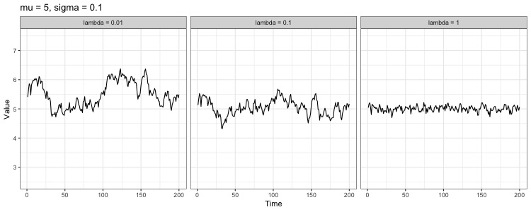
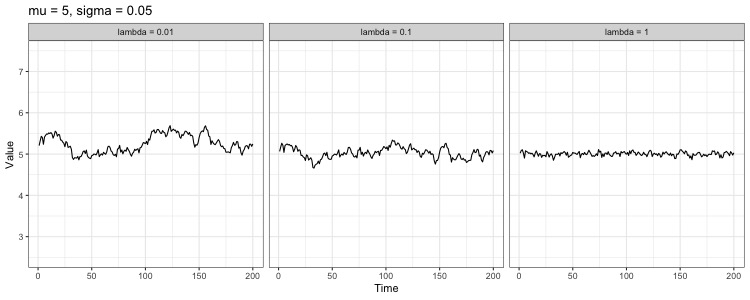

  
```{r setup, include=FALSE}
knitr::opts_chunk$set(echo = TRUE)
knitr::opts_chunk$set(cache=TRUE)
options(mc.cores = parallel::detectCores())

library(rstan)
library(shinystan)
library(tidyverse)
library(reshape2)
library(magrittr)
library(knitr)
library(gridExtra)
library(captioner)
library(bookdown)
library(dplyr)

tbls <- captioner(prefix="Table")
figs <- captioner(prefix="Fig.")
subblck <- captioner(prefix="Supplementary Chunk")
# subtbls <- captioner(prefix="Supplementary Table")
# subfigs <- captioner(prefix="Supplementary Fig.")

set.seed(11235)
source("OU.functions.R")

#Load data if available. If not, set eval = TRUE in sampling chunk.
load("OU_fit_list")
```

## Introduction

The aim of this work is to provide a hierarchical extension of the Ornstein-Uhlenbeck type processes, in order to aggregate information across multiple (short) time series. This extends the recent Stan implementation [@Goodman2018], where parameter estimates of a Student-t type OU process are obtained based on a single (long) time series. We have added a level of hierarchy, which allows inference of the model parameters based on multiple time series.
We validate the implementation and investigate its robustness to variations in sample size and time series lengths  based on simulated data. 

Motivation for this work comes from the analysis of human gut microbiome dynamics. It has been reported that on average the abundance of many gut bacteria remains relatively stable over long time periods [@david_host_2014]. On a shorter (daily) time scale these abundances do however have considerable fluctuations. A number of cross-sectional studies of the human microbiome have characterized the diversity and variation of the gut microbiome between individuals [e.g. @hmp_huttenhower; @Qin2009]. The temporal variation of different taxonomic units within individuals is, however, less well understood [@faust_metagenomics_2015]. One of the current challenges is that the currently available time series are often short, sparse and noisy, and robust inference of dynamical models can be challenging in such case. Some of these limitations can be addressed by adding a level of hierarchy to the model in order to aggregate information across multiple time series. In addition, such extensions can potentially help to analyze the individuality of the time series from different study subjects.

Moreover, given the complex and highly individual nature of the gut ecosystem, exact dynamical models of the underlying system are missing. The OU-type processes provide means to characterize key properties of system dynamics, such as the location and resilience of the potential wells, in a non-parametric manner, when knowledge on the data-generating mechanisms is missing.  Therefore, variants of the OU process appear to provide rigorous and justified methods for modeling these dynamics. However, apart from [@Goodman2018] we are not aware of applications of these models, in particular its hierarchical extensions that we develop here, in the context of human microbiome studies. The methodology itself is very generic, and its potential applications naturally reach beyond population dynamics.


## Background
### Ornstein-Uhlenbeck process
The Ornstein-Uhlenbeck process (OUP), also known as the Langevin equation in physics and Vasicek model in finance, is a stochastic process with a wide range of applications [@Iacus_SDE]. It can be used to model systems with a steady state that recover from perturbations by returning to the long term mean. The OUP is defined by the stochastic differential equation $$dX_t = \lambda (\mu - X_t)dt + \sigma dZ_t,$$
where $X_t$ is the state of the system at time t and $Z$ a stochastic process. Unlike with an ordinary differential equation, the solutions of the stochastic counterpart are nowhere differentiable and non-unique as they are different for different realizations of the noise term. Averaging over these solutions recovers the deterministic solution.

The first term on the right hand side ("drift") describes the deterministic behavior and the second term ("dispersion") characterises the stochasticity of the system. The parameters have natural interpretations as mean-reversion rate ($\lambda$), mean ($\mu$) and scale of stochastic fluctuations ($\sigma$). 




`r figs(name="mu_plots1","Proportion of successful mu estimates against number of time points. Different colors denote number of series. HPDI based rates on the left.")`

Usually the stochastic process is modeled as white noise but for practical purposes requiring $Z_t$ to be Brownian motion with Gaussian transition density is often too a limiting assumption as it does not allow large enough fluctuations and thus is not robust against outliers [@solin_sarkka]. A more general choice is to use the Student-*t* process that allows greater variance between consecutive points. The process $f$ is a Student-t process, $f \sim \mathcal{ST}(\nu, \mu, K),$ with $\nu$ degrees of freedom, mean paramter $\mu$ and covariance kernel $K$,if any finite set of values is multivariate Student-*t* distributed. A  vector $\bar{y} \in \mathbb{R}^n$ is multivariate Student-t distributed, $\bar{y} \sim \mathcal{ST}_n(\nu, \mu, K)$ if it has density
$$p(\bar{y}) = \frac{\Gamma(\frac{\nu + n}{2})}{((\nu-2)\pi)^{\frac{n}{2}}\Gamma(\frac{\nu}{2})}|K|^{-\frac{1}{2}}\times\Big(1 + \frac{(\bar{y}-\bar{\mu})^T K^{-1}(\bar{y}-\bar{\mu})}{\nu - 2}\Big)^{- \frac{\nu+n}{2}}$$
  
  In general this model assumes that the process density is unimodal and likelihood of a point decreases as the distance to the mode increases. This assumption ensures that the model satisfies the relatively simple dynamical nature of a single potential well. Elliptically symmetric processes have such properties and it is known [@shah_student-t] that the Student-t processes are the largest subset of elliptically symmetric process that have an analytical solution. It is a convenient choice also in the sense that the Gaussian process can be obtained as a special case [@solin_sarkka].

Transition density $X_t|X_0$ of a Gaussian OUP is normally distributed, with mean
$\mu - (\mu - X_0)e^{-\lambda t}$ and variance $\kappa(1-e^{-2\lambda t}).$ 
  From these expressions it's easy to obtain the long term mean, $\mu$, and variance, $\kappa$, as $t \to \infty$. Covariance between two time points is given by
$$\textrm{Cov}[X_t, X_{t+\Delta t}]= \frac{\sigma^2}{\lambda} e^{-\lambda\Delta t}.$$

Now let us recall that if $X \sim \mathcal{N}(\mu, \sigma^2),$ then the random variable $X + \epsilon \sigma$, where $\epsilon \sim \mathcal{N}(0,1)$ is Student-t distributed with $\nu=1$ degrees of freedom. Thus we get an expression relating the error terms $\epsilon_i$ and process values $X_i$ at times $t_i$ and $t_{i-1}$, $\Delta t=t_i-t_{i-1}$:
$$X_1 = \mu + \epsilon_1 \frac{\sigma}{\sqrt{\lambda}}$$ and 
$$X_i = \mu - (\mu-X_{i-1})e^{-\lambda \Delta  t} + \epsilon_i \sigma \sqrt{\frac{1-e^{-2\lambda \Delta t}}{\lambda}},$$
for $i=2, \ldots,n.$

Conditional expression for the density of error terms can be derived from Lemma 3 in [@shah_student-t] 
$$\epsilon_i | \epsilon_{1},\ldots, \epsilon_{i-1} \sim \textrm{MVT}_1 \Big(\nu+i-1, 0, \frac{\nu -2 + \sum_{k=1}^{i-1}\epsilon_k^2}{\nu -3 + i} \Big), $$
which reduces to

$$p(\epsilon_i| \epsilon_{1},\ldots, \epsilon_{i-1}) \propto \Gamma(\tfrac{\nu+i}{2})\Gamma(\tfrac{\nu+i-1}{2})^{-1}\big(\nu -2 + \sum_{k=1}^{i-1}\epsilon_{k}^{2}\big)^{-\frac{1}{2}} \Big(1+ \frac{\epsilon_i^2}{\nu -2+\sum_{k=1}^{i-1}\epsilon_k^2} \Big)^{-\frac{\nu + i}{2}}.$$
We will use this expression in the Stan code model block to increment the log density.


#### Hierarchical extension
The model outlined above essentially described the Ornstein-Uhlenbeck driven t-process as implemented in [@Goodman2018]. The novel contribution to this work that  we present now is in equipping the model with hierarchical structure and testing the robustness of the extended implementation. Let $\mathcal{X} = \{\bar{X_j}, j \in \{1, \ldots, N\}\}$ be a set of latent values, with $n_j$ observations in each, each $j$ respresenting e.g. a different measurement site. We assume a hierarchical structure for the parameters $\lambda, \mu$ and $\kappa$,
$$dX_{i,t} = \lambda_i (\mu_i - X_{i,t})dt + \sigma_idZ_t,$$
for all $i \in \{i, \ldots, N\}$.


## The model

In [@Goodman2018] the observations were assumed to be generated by a Poisson process with a rate parameter that the Ornstein-Uhlenbeck process is transformed into via  exponentiation. This so called stochastic Gompertz model is used in ecological time-series analysis [@dennis_2014] where our motivation also lies. However, for a more general and simplified treatment of the OUP we have abandonded this assumption and assume our observations to be directly of the OUP. This will hopefully improve the stability of the sampling as well. 

As the location of the stable state and variance can easily be approximated from the data by simply computing the mean and variance we input these values to the model and focus solely on the mean-reversion parameter $\lambda$. 

The Stan code uses a non-centered parameterization that is modelled using the error terms $\epsilon_i$. We also experimented with the centered parameterization but with less accurate results and more divergent transitions. This is in agreement with [@stan_manual, p.145] where it was mentioned that hierarchical models tend to do better with non-centered parameterizations, especially when the sample size is limited.

Shortly the idea of the Stan code is as follows. After declaring the data and parameters in the corresponding blocks, error terms $\epsilon_i$ and latent values $X_i$ are related in the transformed data block. In the model block parameters and conditional densities for the error terms are incremented to the log density and the observations $Y_{ji}$ are sampled from a Poisson distribution with $X_i$ as the rate.


```

data{
  int <lower=0> T;               // total number of samples
  int <lower=0> n_series;        // number of series
  int <lower=0> samples_per_series[n_series]; 
  real <lower=0> observations[T]; // observation concatenated
  vector [T] time;               // observation times concatenated
  
  vector[n_series] kappa_log;
  vector[n_series] mu;
}
transformed data{
  
  vector[T] observation_vec = to_vector(observations);
  vector[T] time_vec = to_vector(time);
  
  int sample_start[n_series];
  sample_start[1] = 1;
  if(n_series > 1) {
    for(i in 2:n_series)
      sample_start[i] = sample_start[i-1] + samples_per_series[i-1];
  }
  

  
}

parameters{
  vector[n_series] lambda_log;
  real <lower=2> student_df;
  vector[T] epsilon; // t-process 
}

transformed parameters{
  vector[n_series] sigma_log = 0.5*(kappa_log + lambda_log + log2());
  vector[n_series] sigma = exp(sigma_log);
  vector[n_series] lambda = exp(lambda_log);
  vector[n_series] kappa = exp(kappa_log);
  vector[n_series] kappa_inv = exp(-kappa_log);
  vector[n_series] kappa_sqrt = exp(0.5*kappa_log);
  vector[T] latent_observation;
  
  // For each raw latent observation, transform it using the
  // conditional expression for the OU process.
  for(i in 1:n_series){
    
    int n = samples_per_series[i];
    int offset = sample_start[i];
    vector [n-1] time_diff = segment(time_vec, offset + 1, n - 1) -
      segment(time_vec,offset,n-1);
    real cum_squares = 0;
    real last_t = -1;
    real lv;
    for(k in 0:n-1){
      real lv_raw = epsilon[offset + k];
      if(k == 0){
        //For the first latent observation use the stationary distribution.
        lv = mu[i] + lv_raw * kappa_sqrt[i];
      }else{
        real t = time_diff[k];
        real exp_neg_lambda_t = exp(-t*lambda[i]);
        real sd_scale = kappa_sqrt[i] .* sqrt(1-square(exp_neg_lambda_t));
        lv = mu[i] - (mu[i] - lv) .* exp_neg_lambda_t + lv_raw .* sd_scale;
        last_t = t;
      }
      latent_observation[offset+k] = lv;
    }
    
  }
}
model {
  
  target += sum(lambda_log);
  target += sum(kappa_log);
  
  
  // Increment the log probability according to the conditional expression for
  // the unit multivariate t-distribution.
  for(i in 1:n_series){
    int n = samples_per_series[i];
    int offset = sample_start[i];
    vector[n] sq_lv = square(epsilon[offset:(offset + n - 1)]);
    vector[n] cum_squares = cumulative_sum(append_row(0,sq_lv[1:n-1]));    
    for(k in 1:samples_per_series[i]){
      target +=  (lgamma((student_df + k) * 0.5) - lgamma((student_df+ k - 1 )* 0.5));     
      target += -0.5 * (student_df + k) * log1p(sq_lv[k] / (student_df + cum_squares[k] - 2));
      target += -0.5 * log(student_df + cum_squares[k] - 2);
    }
    
  }
  
  // Add the log probability for the observations given the latent observations
  observations ~ normal(latent_observation, 0.01);
  
  
  // Priors
  lambda ~ normal(0,5);
  student_df ~ gamma(2,.1);
}

```


## Testing

The model is tested on simulated data generated by the sampling scheme in Lemma 2.2 [@solin_sarkka]: if $\bar{y}|\gamma \sim \mathcal{N}(\mathbf{\mu}, \gamma K)$, where $\gamma$ is inverse gamma distributed $\gamma \sim  \textrm{IG}(\nu/2, (\nu-2)/2)$, then  marginally $\bar{y} \sim \textrm{MTV}_n(\mu, K, \nu).$  The function ```generate_data_set``` creates a list of data in the form that the Stan model can read. 

Robustness of parameter estimates is tested with several different data sets. First we'll let the number of observations run from 2 to 10 and number of time series from 5 to 25 in increments of 5. Then we'll fix the number of observations (5) and let the number of series run from 5 to 100 in increments of 5. 

```{r} 

data_set <- list()

# observation 2 -> 10, increments of 1
for(i in 5*(1:5)){
for(j in 2:10) {
data_set[[paste(i,"series",j,"observations")]] <- generate_data_set(kappa=0.1,
lambda=1, mu=5, intervals=1:j, n_series=i, t.df=7, seed=1)
}
}

# 5 observations, series 30 -> 100, increments of 5
for(i in 5*(6:20)) {
data_set[[paste(i,"series",5,"observations")]] <- generate_data_set(kappa=0.1,
lambda=1, mu=5, intervals=1:5, n_series=i, t.df=7, seed=1)
}

n_series <- 5*1:20
n_obs <- 2:10
```


Next we input simulated data to ```hier_concentered.stan```. 
Sampling for the entire data set took a considerable amount of time on a basic laptop (1,3GHz, 4 cores), close to 11 hours, so the sampling block below is not evaluated. Default settings were used, but in order to decrease the amount of divergent transitions ```adapt_delta``` was set to 0.9. Divergencies were not eliminated altogether and the amount ranged from 0 to 50, averaging at about 7 per sampling. 

```{r sampling, eval=FALSE}
hier_model <- stan_model("hierarchical_noncentered.stan")
fit_list <- list()
for(i in 1:length(data_set)) {
fit_list[[names(data_set)[[i]]]] <-
  sampling(noncentered_hiearchical, data_set[[i]], control=list(adapt_delta=0.9))
}
```


Measure performance with mean.  

```{r, message=FALSE, warning=FALSE}


```


### Precision


### Diagnostics & Running time


## Discussion
The main objective of this work was to extend a previously propsed implementation of the Ornstein-Uhlenbeck driven Student-t process in Stan by adding a new level of hierarchy to the model. By partial pooling, the parameter inference could utilize information across multiple time series. In terms of the defined metrics the model performance was satisfactory. The parameter characterizing the stochastic fluctuations, $\kappa$ was an exception, as the precision of estimates decreased as more data was available. 

The tests of robustness executed here provide only preliminary results of the model capabilities. For a complete picture an extensive probing of different parameter ranges and priors should be undertaken. Alternative parameterizations should be tested to see if some perform better with higher sample sizes. As the OU process can be considered an extensions of the autoregressive AR(1) model with arbitrary time intervals, we are planning to develop this work further by enabling the time series to have unequal amounts of observations and unequal measurement times. This would allow the analysis of time series with missing values and eliminate the need for interpolation and forcing even observation times. 

The HIT Chip Atlas data set [@TippingElements], consists of stool samples from 1006 Western individuals with multiple (2-5) time points for 78 subjects, and provides an interesting opporturnity to test the model on real data. This has motivated the work presented here, and we are next planning to apply our validated implementation on this real case study of the human gut microbiome analysis.

\newpage

# Licences 
Code and text © 2018, Ville Laitinen & Leo Lahti, licensed under CC BY 4.0.

# Bibliography


